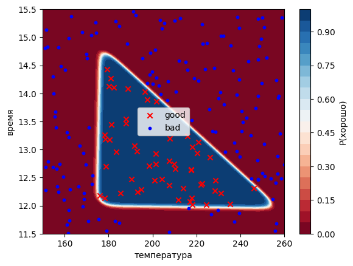

# Coffee Roasting Classifier — Neural Network from Scratch (PyTorch)

A small neural network that classifies coffee roasts as **good** or **bad** based on two
features: roasting **temperature** and **duration**. Built entirely from scratch in PyTorch —
including a manual training loop — to understand what frameworks like Keras hide behind
`model.fit()`.

This project reimplements the classic "Coffee Roasting" lab from Andrew Ng's
*Machine Learning Specialization* (originally in TensorFlow/Keras) using **PyTorch**, with
every step written and reasoned through manually.

## What it does

- Generates a synthetic dataset of 200 roasts, labelling each as good/bad by a
  triangular "good zone" rule (temperature, duration, and a "hotter = shorter" constraint).
- Splits the data into train/test sets and applies **Z-score normalization**
  (statistics computed on the training set only, to avoid data leakage).
- Defines a small feed-forward network: `2 → 3 (sigmoid) → 1 (sigmoid)`.
- Trains it with a **hand-written training loop** (forward → loss → backward → step),
  using binary cross-entropy loss and the Adam optimizer.
- Evaluates accuracy on the held-out test set.
- Visualizes the **loss curve** and the **decision boundary** learned by the network.

## Results

- Test accuracy: 100% on this synthetic dataset
- The learned decision boundary recovers the triangular "good zone" — each of the three
  hidden neurons learns one edge of the triangle.


## Architecture

| Layer | Type | Shape | Params |
|-------|------|-------|--------|
| Hidden | Linear + Sigmoid | 2 → 3 | 9 |
| Output | Linear + Sigmoid | 3 → 1 | 4 |
| **Total** | | | **13** |

## Tech stack

- Python, PyTorch
- NumPy, Matplotlib
- scikit-learn (train/test split)

## How to run

```bash
git clone https://github.com/alexshklyarov/coffee-roasting-pytorch.git
cd coffee-roasting-pytorch
pip install torch numpy matplotlib scikit-learn
jupyter notebook coffee.ipynb
```

## What I learned

- How a training loop actually works: `zero_grad` → `backward` → `step`.
- Why normalization statistics must come from training data only.
- How autograd computes gradients automatically via the computation graph.
- How a network of simple linear units composes into a non-linear decision boundary.
